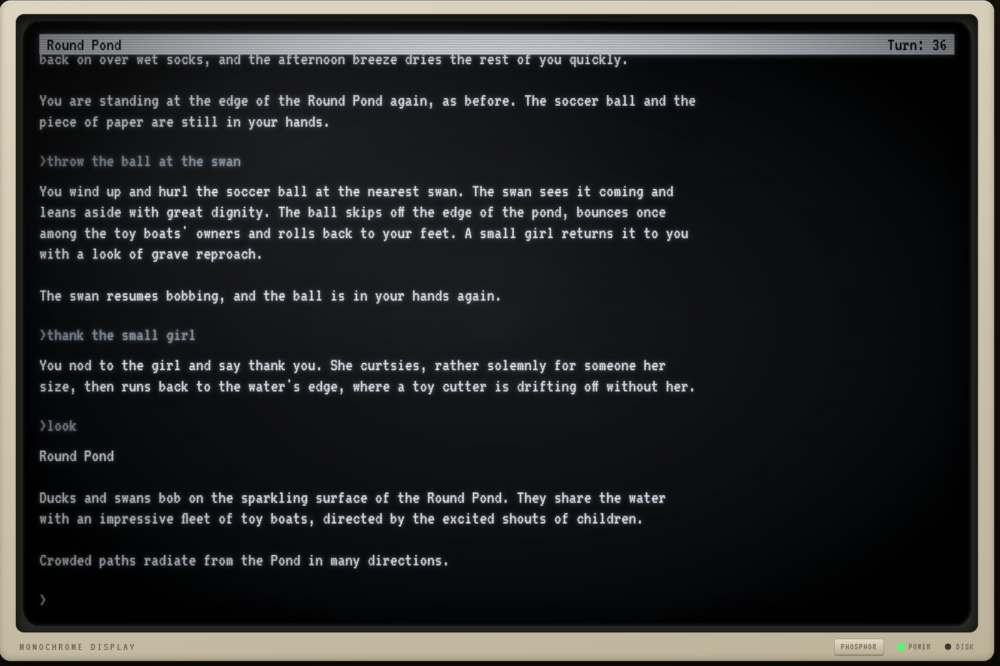

# Infocom, with an AI Dungeon Master

**Play the original Infocom games — built from their own ZIL source code — with an
LLM as the Dungeon Master.** The game's logic stays faithful: the map, the objects,
the clock, the deadlines, the score and the puzzles all come from Infocom's code. A
deterministic engine holds the state, runs the clock and the score, and evaluates
the code's conditions; the LLM reads the routines and applies them. But the 1986
parser is gone: type what you mean, try things the authors never anticipated,
and the DM plays them out.



## Why not just ask a chatbot to play it?

You can ask any LLM to "play Trinity with me". It will oblige, from memory — and
memory is the problem:

| | Ad-hoc chat | This harness |
|---|---|---|
| **The game itself** | A fuzzy recollection from training data: rooms, wording and puzzles half-remembered or invented | Built from Infocom's own ZIL source: the real map, objects, text and puzzle logic |
| **State** | Lives in the conversation; objects appear and vanish, inventory is forgotten, rooms change between visits | Held by a deterministic engine in a save file; consistent across hundreds of turns, restarts and sessions |
| **Time** | No clock: Trinity's deadlines are forgotten or improvised | The game's own clock — 15 seconds a move, the air raid at 3:57:45 — and its timed events, on schedule |
| **Puzzles** | Either anything works, or things fail arbitrarily | The intended solution works; clever alternatives are judged fairly and land where the intended one would; bypasses don't |
| **Spoilers** | The model knows the walkthrough, and it shows | The solutions are DM-only, used to judge actions, never to hint |
| **Long games** | The context fills, and early facts drift or fall away | Each turn starts from fresh engine state; nothing depends on remembering the transcript |
| **Checking it** | Trust | Regression tests and scripted evaluations of the game's logic |

This isn't hypothetical. While this was being built, every gap the DM had to fill
from memory went wrong: with a constant missing it described Palace Gate's
glades as stretching "to the east" (the source says northeast); with no clock in
the engine it made up the wristwatch's time; and an early set of DM notes
invented a "London Blitz" episode that Trinity doesn't have. Closing those gaps
with the source and the engine is what fixed them. The LLM is still the storyteller, and it's free to be
creative, but the world it describes is the real one.

## Showcase: Trinity (Brian Moriarty, 1986)

Trinity is the showcase world: Moriarty's game about the atomic age, which opens
on the last afternoon of a London holiday, in Kensington Gardens, half an hour
before the bombs fall.

**What stays as Infocom wrote it**

- **The clock and its deadlines.** The wristwatch starts at 3:30:00 pm and gains
  15 seconds a move; the air raid begins at 3:57:45 on the 112th move, as in the
  original. Every timed event is driven by the game's own interrupt routines.
- **The puzzles, the score and the map.** The intended solutions work; points
  are awarded as the game awards them; exits, blocked paths and conditional
  routes come from the source.
- **The world's facts.** Each turn the DM gets the relevant room, object and verb
  code, with its constants resolved and its conditions evaluated against live
  state, so it narrates from the truth instead of guessing.

**What the DM adds**

- **No parser.** "follow the little path", "get me out of here", "who am I?" —
  the DM works out what you mean.
- **The sleight of hand is gone.** Many 1986 refusals ("Swimming in the Round
  Pond is strictly forbidden") covered what the engine couldn't simulate. If an
  action wouldn't change anything the game depends on, the DM lets it happen:
  wade in until the parkkeeper's whistle, race toy boats with the children, throw
  the ball at a swan.
- **Your own solutions.** A clever, non-trivial solution the authors didn't
  anticipate can work, landing where the intended one would. Trivial bypasses
  don't.
- **A DM at the table.** Ask for a hint, ask why, or say `god mode:` — you get an
  answer out of character, and the game clock doesn't move. The feelies you
  don't have (the sundial's symbols, the map) are supplied.
- **Remastered, or classic.** By default you play the remastered edition: the same
  world told more richly — fuller, sensory descriptions in the original's mood
  ("their hoods bob and their wheels creak like a slow parade of tiny carriages")
  — with every fact unchanged and nothing added that you could interact with.
  Classic keeps the original's economy of prose.

## Play

```bash
uv venv .venv && uv pip install --python .venv/bin/python pydantic pyyaml sexpdata

# play in the retro terminal at http://127.0.0.1:8086
.venv/bin/python web/server.py --game trinity --world worlds/trinity.json --new --model sonnet

# or in classic style (remastered is the default)
.venv/bin/python web/server.py --game trinity --world worlds/trinity.json --new --model sonnet --style classic
```

The DM runs on your Claude Code login — no API keys. `worlds/trinity.json` is
included; to rebuild it from Infocom's source, see [Worlds](#worlds). Other ways to
play (inline in Claude Code, relay, subagent per turn) are under
[Ways to run](#ways-to-run).

## How it works

An LLM left to run a text adventure on its own drifts: objects appear and vanish,
rooms change between visits, rules bend. Here the LLM is the Dungeon Master, and
the world lives somewhere else.

```
 Infocom ZIL source ──► converter + zil_extras ──► world JSON
                                                      │
                          ┌───────────────────────────┴──────┐
     player ──► DM (Claude) ◄── turn context ── engine (scripts/if_engine.py)
                   │                               ▲  state · clock · interrupts
                   └──── apply updates ────────────┘  score · scope · conditions
                   │
                   └──► narration
```

- **The world** is built from the game's own source. `tools/zil_converter` turns
  ZIL into JSON; `scripts/zil_extras.py` adds what a plain conversion loses: string
  constants and object names, the game clock and its interrupt routines, the
  objects' point values, the verb grammar, conditional exits, the parser's
  tie-breaker routines, and the canonical intro.
- **The engine** (`scripts/if_engine.py`) holds the truth: where everything is,
  the turn and the clock, the queued interrupts and when each one is due, the
  score, the game's global variables and object flags.
- **Each turn** the DM receives a context built for that command: the room and its
  code, the code of every object the command names, the verb's own routines,
  the interrupts running, and every condition in that code already evaluated
  against live state (`IS? EWIND SEEN: true`, `GOT? COIN: true`). The DM decides
  what happens, applies it through the engine — mirroring the game's own
  operations (`--queue I-BLOW:2`, `--make lwdoor:touched`, `--set-clock`) — and
  narrates the result. Most turns need one engine call.
- **The DM's rules**: the game's logic binds; its 1986 parser and its wording
  don't. Refusals that only covered what the old engine couldn't simulate become
  play; refusals that protect the map or a puzzle keep their outcome. Clever,
  unanticipated solutions can work; trivial bypasses don't. Anything addressed to
  the DM gets an out-of-character answer. The full rules are in
  [`web/dm_system.md`](web/dm_system.md).
- **A DM brief per game** (`worlds/<game>_DM_BRIEF.md`) sets out the structure, the
  clock and every deadline, text conventions, characters, the feelies, and a
  DM-only spoiler section used to judge whether an action succeeds.
- **The architectural principles** behind the engine — state-driven updates,
  mechanics separate from narration, the LLM as DM rather than game engine — are
  in [`CLAUDE.md`](CLAUDE.md).

## Ways to run

The Dungeon Master is Claude, through Claude Code — your normal `claude` login, no
API keys.

| Mode | Start it with | Best for |
|---|---|---|
| **Web terminal, headless** | `web/server.py --game trinity --model sonnet` | Playing. One persistent `claude -p` session per game behind the retro terminal; narration streams; a guard catches parser-style replies. |
| **Web terminal, relay** | `web/server.py --game trinity --dm relay` | Watching a Claude Code session DM in the browser. |
| **Inline** | "play trinity inline" in Claude Code | Playing in the terminal with the `play-if` skill. |
| **Subagent per turn** | the `play-if-dm` agent | Long games: a fresh agent each turn keeps cost flat. |

Options: `--style` (`remastered` — the default: richer, sensory descriptions in the
original's mood, every fact unchanged — or `classic`, the original's economy), `--model`
(opus, sonnet…), `--effort` (low…max; Sonnet's default is medium), `--new` with
`--world` for a fresh game. Saves and transcripts live in
`saves/`; a reload redraws the screen. The server starts a fresh DM conversation
on the same game whenever the DM prompt changes.

## Worlds

| World | State |
|---|---|
| `trinity` | **Showcase.** Rebuilt from the original source with the full DM layer, DM brief and evals. |
| `zork_original`, `planetfall`, `colossal_cave` | Earlier conversions. Playable, but not yet rebuilt with the fixed converter and `zil_extras`. |
| `example_dungeon` | Small hand-written world. |

**Adding a game**

1. Put its ZIL source in `resources/zil/<game>/` (from
   `github.com/historicalsource/<game>`; kept out of git). Zork I–III are
   MIT-licensed (Microsoft, 2025).
2. `.venv/bin/python scripts/build_world.py <game>` — converter, the hand-written
   context in `worlds/<game>_context.json`, then `zil_extras`. The build is
   reproducible: rebuilding Trinity gives the committed world exactly.
3. Write `worlds/<game>_DM_BRIEF.md` from the source (clock, deadlines,
   conventions, feelies, spoilers) — Trinity's is the template.
4. Add an eval spec in `evals/`.

## Testing and evaluation

- **Engine regressions** — `tests/test_if_engine_zil.py`: 18 deterministic tests,
  no LLM, a few seconds. Each pins a bug found in play-testing.
  ```bash
  .venv/bin/python -m pytest tests/test_if_engine_zil.py
  ```
- **DM evaluation** — `scripts/dm_eval.py` plays a scripted route through the real
  headless DM on a fresh save and checks the game's logic after every step
  (location, score, inventory, timing), never its wording. Improvised steps can be
  rated by an LLM judge for creativity and invented facts. Reports go to
  `evals/results/`.
  ```bash
  .venv/bin/python scripts/dm_eval.py evals/trinity_gardens.json --model sonnet --judge sonnet
  ```

  | Spec | Checks |
  |---|---|
  | `trinity_gardens` | The Gardens to the first portal: route, score, gust timing, the purchase |
  | `trinity_meta` | Hints, "why…?", `god mode:`, feelies — answered, not parsed, no time lost |
  | `trinity_sleight` | Cosmetic refusals become play; load-bearing ones hold |
  | `trinity_emergent` | Trivial bypasses fail; alternative solutions are judged fairly |

  Sonnet reached the Meadow passing 39 of 40 logic checks, at a median of 6.8 s
  a turn.

## Repository layout

```
scripts/if_engine.py      engine CLI the DM drives (init/look/context/apply/inspect)
scripts/zil_extras.py     post-conversion: constants, clock, interrupts, grammar, ...
scripts/build_world.py    reproducible world build from ZIL source
scripts/dm_eval.py        scripted DM evaluation with optional LLM judge
web/                      retro terminal: server.py, relay.py, dm_system.md, static/
.claude/skills/play-if/   the play-if skill (inline DM)
.claude/agents/           play-if-dm (subagent-per-turn DM)
tools/zil_converter/      ZIL -> world JSON converter
worlds/                   built worlds, DM briefs, hand-written contexts
evals/                    eval specs (results git-ignored)
src/                      engine models, state updates and rules
tests/                    test suite
```

## License

The project's code is [MIT](LICENSE). The games are not: their ZIL source and the
text carried into converted worlds belong to their rights holders. Zork I–III's
source is MIT-licensed by Microsoft (2025); other Infocom titles have no clear
licence, which is why their source is kept out of this repository.
